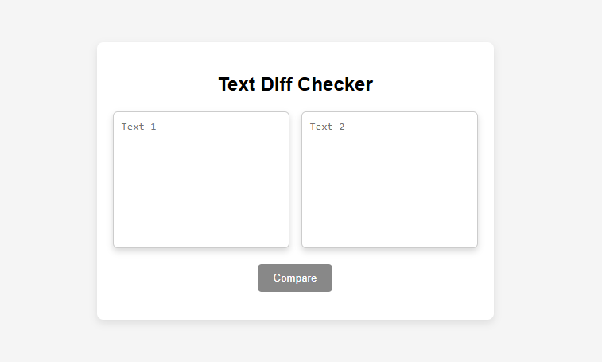
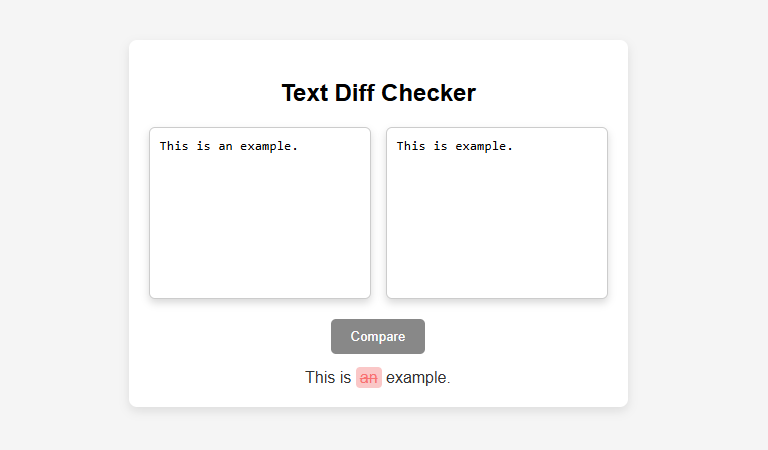

# Text Difference Checker

> A modern web application that compares two text inputs and highlights the differences instantly for quick and easy analysis.


---

# Features

✅ Compare two text inputs instantly  
✅ Highlight added and removed text  
✅ Real-time difference detection  
✅ Clean and responsive UI  
✅ Easy-to-read output formatting  
✅ Lightweight and fast performance  

---

# Screenshots

<p align="center">
  
</p>

<p align="center">
  
</p>

---

# Tech Stack

| Technology | Purpose |
|------------|---------|
| HTML5 | Structure |
| CSS3 | Styling & Responsive Design |
| JavaScript | Text Comparison Logic |

---

# Getting Started

## Clone the Repository

```bash
git clone https://github.com/Anurag-3112/text-difference-checker.git
```

## Navigate to the Project

```bash
cd text-difference-checker
```

## Run the Project

Simply open:

```bash
index.html
```

in your browser.

---

# How It Works

1. Enter the original text  
2. Enter the modified text  
3. Click compare  
4. Instantly view highlighted differences  

---

# Project Structure

```bash
text-difference-checker/
│── index.html
│── style.css
│── script.js
│── assets/
│   ├── screenshot1.png
│   └── screenshot2.png
```

---

# Future Improvements

- [ ] Line-by-line comparison
- [ ] Side-by-side diff view
- [ ] Copy comparison result
- [ ] Export diff result
- [ ] Dark / Light mode
- [ ] Word-level highlighting

---

# What I Learned

This project helped me improve my understanding of:

- DOM manipulation
- String comparison logic
- Dynamic content rendering
- JavaScript event handling
- Responsive frontend design

---

# Contributing

Contributions are welcome!

If you'd like to improve this project:

1. Fork the repository
2. Create a feature branch
3. Commit your changes
4. Open a Pull Request

---

# Author

### Anurag Kumar

Frontend Developer | JavaScript Enthusiast

GitHub: [@Anurag-3112](https://github.com/Anurag-3112)

---

# ⭐ Support

If you like this project, consider giving it a ⭐ on GitHub!
